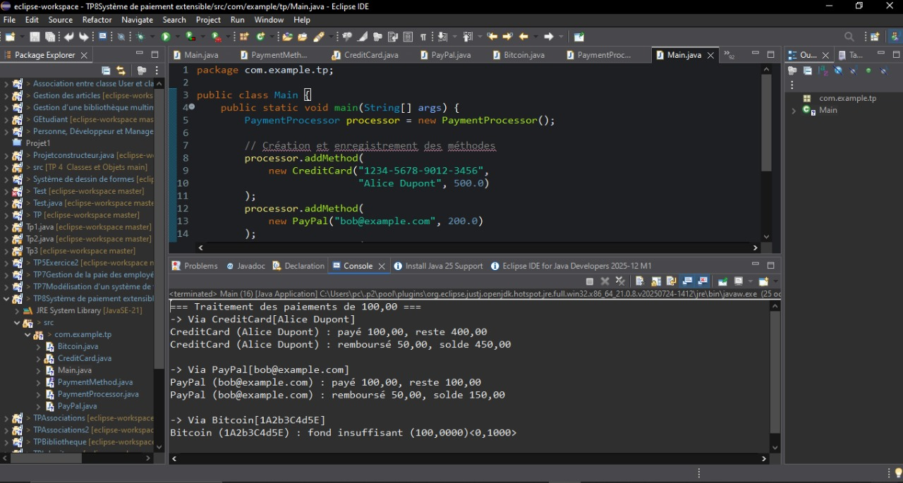
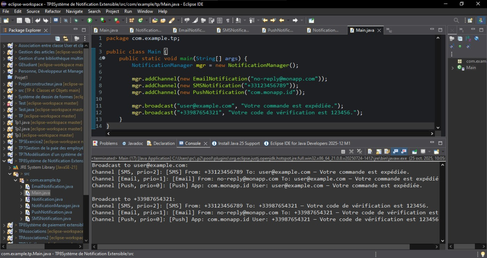

#  TP 8 — Interfaces en Java  
###   Cours : Fondamentaux et Concepts Avancés de la Programmation Java  

---

##  Objectifs généraux
- Comprendre le rôle des **interfaces** en Java pour définir des contrats indépendants des implémentations.  
- Découpler le code métier des détails techniques des sous-classes.  
- Gérer des **tableaux dynamiques** d’objets hétérogènes.  
- Appliquer les principes **SOLID (Open/Closed Principle)** pour rendre le code extensible sans modification.  

---

#  **Exercice 1 — Système de Paiement Extensible**

##  Objectifs pédagogiques
- Définir un contrat commun `PaymentMethod` pour différents moyens de paiement.  
- Simuler les paiements et remboursements sans dépendre des classes concrètes.  
- Gérer dynamiquement plusieurs moyens de paiement via `PaymentProcessor`.  

---

##  Structure du projet
 ```bash
TP8Système de paiement extensible/
└─ src/
└─ com/example/tp/
├ PaymentMethod.java
├ CreditCard.java
├ PayPal.java
├ Bitcoin.java
├ PaymentProcessor.java
└ Main.java
````


##  Description des classes principales

- Interface `PaymentMethod`
Définit le contrat pour tout moyen de paiement :

boolean pay(double amount);
boolean refund(double amount);
String getName();

 -CreditCard
Simule un paiement par carte bancaire.
Attributs : number, holder, balance.
Comportement : paiement si solde suffisant, remboursement possible.

 -PayPal
Simule un paiement en ligne via un email et un solde.
Priorité moyenne.

 -Bitcoin
Paiement simulé via une adresse de portefeuille.
Affichage en BTC à 4 décimales.

- PaymentProcessor
Gère un tableau extensible de PaymentMethod.


- Main
Instancie plusieurs méthodes de paiement, les enregistre, puis exécute les transactions.

## Résultat visuel
<div align="center">  <p><em>Figure 1 </em></p> </div>

 ##  Exercice 2 — Système de Notification Extensible

### Objectifs pédagogiques

Créer un système polymorphe de notification.

Implémenter plusieurs canaux (Email, SMS, Push) partageant une même interface.

Gérer un tableau dynamique et trier les notifications selon leur priorité.

### Structure du projet
```BASH
TP8Système de Notification Extensible/
└─ src/
   └─ com/example/tp/
      ├ Notification.java
      ├ EmailNotification.java
      ├ SMSNotification.java
      ├ PushNotification.java
      ├ NotificationManager.java
      └ Main.java
````
### Description des classes
-Interface Notification
void send(String recipient, String message);
int getPriority();   // 0 = basse, 1 = normale, 2 = haute
String getType();

-EmailNotification

Envoie un message simulé par e-mail.

Priorité : 1 (normale).

- SMSNotification

Simule un envoi par SMS.

Priorité : 2 (haute).

 -PushNotification

Simule une notification d’application mobile.

Priorité : 0 (basse).

- NotificationManager

Gère un tableau extensible de canaux (Notification[]).

Trie les canaux par priorité décroissante avant diffusion


Envoie chaque message via la méthode send() de l’interface.

-Main

Instancie le gestionnaire, ajoute les canaux, et diffuse plusieurs messages.

 Résultat visuel
<div align="center">  <p><em>Figure 2 </em></p> </div>

### Compilation & Exécution globale

Depuis le dossier src/ :

# Compilation (tous les fichiers du TP8)
javac com/example/tp/*.java

# Exécution pour les exercices
java com.example.tp.Main  
